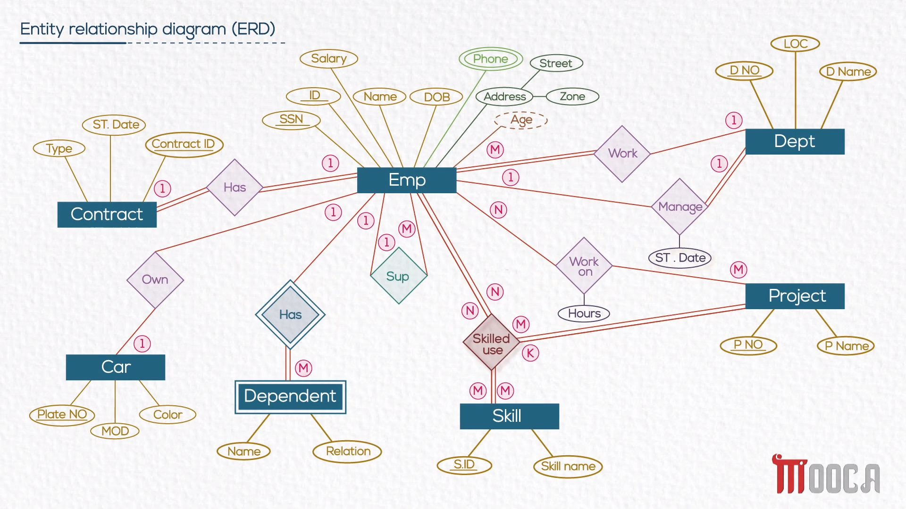
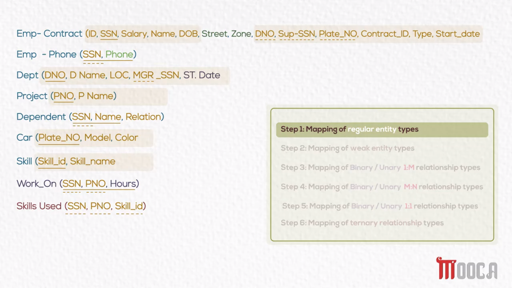
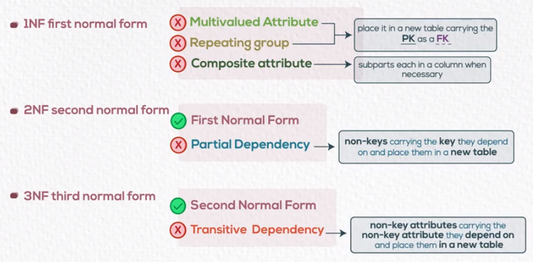

### #01 Entity Relationship Diagram (ERD) "Conceptual Design"

**Diagram Component**

- entity
- attribute
- relations
  - degree  (----<>----)
  - cardinality ratio (1 to many, many to many, ...)
  - participation (must, may)

Example

### #02 ERD Mapping to Tables "Logical Design"

(tuple = row), (attribute = column) 	intersection between them create (Domain = cell)

strong entity : entity has attribute can be primary key

Unary relationship : relation between entity and it self 

attribute on relationship follow foreign key

**Steps :**

1. mapping week and strong entity	

   * entity to table

   * attributes to column in table
     * multi value attribute new table with foreign key
     * derived attribute we not store it in DB "headache on DB because it's built on calculations"

   * choose primary key 
     * for week entity we use primary key of owner entity  as foreign key + attribute as primary key

2. mapping relationships types
   * binary / Unary Relationship
     * 1 : 1 relations
       * may - must 	primary key of may side as foreign key in must side
       * may - may       primary key of any side as foreign key in other side 
       * must -must     merge two tables in one table then choose primary key 
     * 1 : M relation 	primary key of one side as foreign key of other side
     * M : M relation     primary keys of participating entities as  foreign key on new table and add relationship attributes
   * Ternary Relationship
     * new table with primary keys of three entities as foreign key

Example :

solid line primary key

dash line foreign key

### #03 SQL "Physical Design"

- #### DDL : Data Definition Language "deal with structure of the database schema"

  - **Create :**

    ​	 `CREATE TABLE [table_name] ([column_name, data_type, constraint], ...)`

  - **Alter :** 

    ​	`ALTER TABLE [table_name] ADD [column_name]` 

    ​	 `ALTER TABLE [table_name] drop [column_name]` 

  - **Drop :**  

    ​	`DROP TABLE [table_name]`

  - **Truncate :** "delete all table data and keep structure & can't roll back"

    ​	`TRUNCATE TABLE [table_name]`

  

- #### DML : Data Manipulation Language "deals with the manipulation of data present in the database"

  - **Insert :** 

    ​	`INSERT INTO [table_name] ([column_name], ...) VALUES ([value1], ...)`

    ​	`INSERT INTO [table_name] VALUES ([value1], ...)`

  - **Update :**

    ​	`UPDATE [table_name] SET [column_name] = [value] WHERE [condition]`

  - **Delete :**

    ​	`DELETE FROM [table_name] WHERE [condition]`

  - **Select :**

    ​	`SELECT [column_name] FROM [table_name] WHERE [condition]`

- #### DCL : Data Control Language "give privilege access to data objects"

  - **Grant :** add privilege 

    - `GRANT [command] ON TABLE [table_name] TO [username]`

      GRANT	 SELECT     ON TABLE    employee    TO    Ahmed

      GRANT	     All          ON TABLE    employee    TO    Ahmed,Mohamed

      GRANT	 SELECT     ON TABLE    employee    TO    Ahmed  WITH GRANT OPTION "Ahmed can share privilege with other users"

      

  - **Revoke :** remove privilege

    - `REVOKE [command] ON TABLE [table_name] FROM [username]`

      REVOKE	 SELECT     ON TABLE    employee    FROM    Ahmed

      REVOKE	     All          ON TABLE    employee    FROM    Ahmed,Mohamed

#### DML Details

 - **Comparison & Logical operators**

    - Single row operators

      `WHERE [column_name] >,<,= [value]`
     
      `WHERE [column_name] >=,<= [value]`
     
   
   ​		`WHERE [condition] AND [condition]`
   
   ​		`WHERE BETWEEN [value] AND [value]`
   
   ​		`WHERE [condition] OR [condition]`
   
     - Multi row operators
   
   ​		`WHERE IN ([value], [value])`
   
   ​		`WHERE [value] > all(sub-query)` "all(sub-query) represent highest value"
   
   ​		`WHERE [value] > any(sub-query)` "any(sub-query) represent lowest value"
   
- **LIKE operator**

  `WHRER [column_name] LIKE ?Z*`

  "?" replace 1 char

  "*" replace 0 or more chars

* **Alias**

  `SELECT [column_name + calculation] AS [column_name]`

* **Order by**

  `ORDER BY [column_name][ASC|DESC], [column_name][ASC|DESC]` "multi level sorting"

* **Distinct**

  `SELECT DISTINCT [column name] FROM [table_name]`

  filter repeated records

* **Joins**

  - **inner "return matched record"**

    `SELECT [column_name], [column_name] FROM [table_name], [table_name] WHERE [join condition]`

    `SELECT [column_name], [column_name] FROM [table_name] INNER JOIN [table_name] ON [join condition]`

    join condition is a relation between foreign key and primary key

  - **outer "return full data"**

    - left outer join  "return full data from left table"

      `SELECT [column_name], [column_name] FROM [table_name] LEFT OUTER JOIN [table_name] ON [join condition]`

    - right outer join  "return full data  from right table"

      `SELECT [column_name], [column_name] FROM [table_name] RIGHT OUTER JOIN [table_name] ON [join condition]`

    - full outer join  "return full data both table"

      `SELECT [column_name], [column_name] FROM [table_name] OUTER JOIN [table_name] ON [join condition]`

  - **self  "recursive relationship"**

    `SELECT [column_name], [column_name] FROM [table_name], [table_name] WHERE [join condition]`

    Example :

    `SELECT e.fname, s.fname FROM employee AS e, employee AS s WHERE e.superssn = s.ssn`

  

* **Sub-Queries**

  `WHERE [condition between value and query]`

  Example :

  `WHERE salary > (SELECT salary FROM employee WHERE fname='Mohamed' AND lname='Ahmed')`

* **Aggregate Functions**

  ` COUNT([column_name])  `

  `SUM([column_name]) `

  ` MIN([column_name]) `

  ` MAX([column_name]) `

  `AVG([column_name]) `

  if we use Aggregate Functions in condition we replace `WHERE` with `HAVING`

* **Group by**

  `SELECT [column_name] FROM employee GROUP BY [column_name]`

### #04 Views "logical Tables"

​	`CREATE VIEW [view_name] AS [Sub-Query]`

​	Example :

​	`CREATE VIEW vw_work_hrs`

​	`AS`

​	` SELECT name, phone, hours ` 

​	`FROM employee, project `

​	`WHERE SSN=ESSN`

​	`WITH CHECK OPTION` "verify condition on insert new data"

Then we can deal with **VIEW as Data Object** (create , modify , remove)

		- `CREATE OR REPLACE VIEW [view_name]`
		- `DROP VIEW [view_name]`

Why to use view

	1. Restriction of data access
	2. Make complex queries easy
	3. Provide data independent
	4. Present different views of same data

**INDEXES** :

While Indexes are special lookup tables that the database search engine can use to speed up data retrieval. Simply put, an index is a pointer to data in a table. An index in a database is very similar to an index in the back of a book .

`CREATE INDEX [index_name] ON [table_name(column_name)]`

`DROP INDEX [index_name] `

### #05 Normalization
	
​ 	

​	https://www.guru99.com/database-normalization.html
